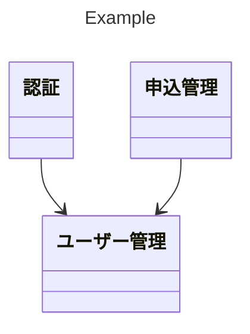
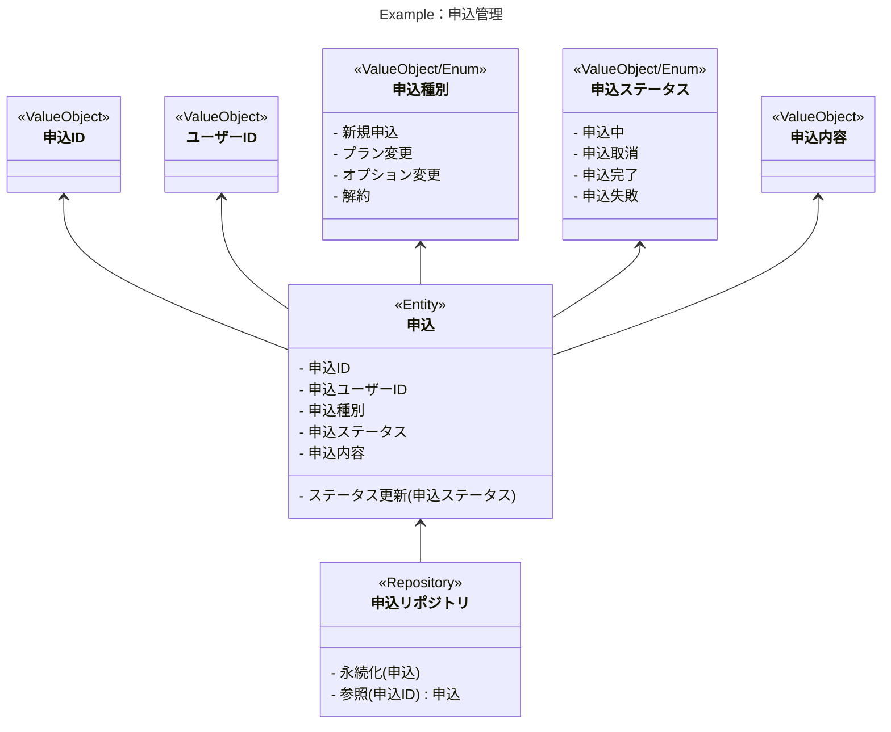

# Basics

## 目次

1. 前提
2. 使用するライブラリ/FW
3. ドメイン駆動設計(DDD)について
4. コンテキストマップと Go Module の関係性
5. プロジェクト全体のディレクトリ/パッケージ構成の例

## 1. 前提

- こちらは [株式会社ラクス](https://www.rakus.co.jp/) の SRE 課で担当するプロジェクトにおける、Go 言語での WebAPI 実装に関するノウハウをまとめた資料です。
- 当資料に記載されたソースコードは動作を保証するものではありません。ご理解いただいた上、自己責任においてご利用ください。

## 2. 使用するライブラリ/FW/Middleware

当資料で使用しているライブラリ/FW は以下です。

- Web フレームワーク: [gin-gonic/gin](https://github.com/gin-gonic/gin)
- ORM: [GORM](https://gorm.io/ja_JP/docs/index.html)
- DI ツール: [google/wire](https://github.com/google/wire)

また、[Row Level Security](./row-level-security.md)ページは PostgreSQL を使用する前提で記述しています。

## 3. ドメイン駆動設計(DDD)について

DDD に関する以下の成果物を作成することを推奨します。

- コンテキストマップ
- ドメインモデル

### コンテキストマップ

- DDD における複数の「境界づけられたコンテキスト」の関係性を定義した図
- 「境界づけられたコンテキスト」は課題を解決するソリューションの単位
  - たとえば認証処理に関する領域を「認証コンテキスト」、ユーザー管理に関する領域を「ユーザー管理コンテキストと名付けたりする
- コンテキスト間の関係性は、依存関係として矢印で表す
  - 矢印の根本から先端のコンテキストに向けて依存している
  - 「A コンテキストが B コンテキストに依存」＝「A コンテキストから B コンテキストが利用されている」



### ドメインモデル

- ドメインモデルとは
  - コンテキストに紐づいたドメイン(業務領域)を抽象化した図
  - ドメイン知識を羅列し、それらの依存関係を矢印で示す
- ドメイン知識をドメインモデル上で表現するパターンとして使われる主な概念
  - 値オブジェクト(ValueObject, VO)
    - 値を表す概念。不変。（氏名、誕生日等）
    - 値が変わると別の値オブジェクトになる
      - 例）改姓した場合、「氏名」という値オブジェクトは別になる
  - エンティティ
    - ID を持っており同一性で比較される概念
    - 属性の変更があっても同一性が継続される
      - 例）「ユーザー」というエンティティは、「氏名」という属性が改姓によって変更されても、「ユーザー ID」が変わらないので同一性が継続される
  - ドメインサービス
    - 値オブジェクトやエンティティに持たせると不自然になる振る舞いを持つ
    - 複数のエンティティをまたいだ判断が必要な場合等に使われる
    - 複雑な処理をドメインサービスに入れがちなので、各エンティティで適切な責務分割ができないかを検討してから使うのが良いと思われる
  - 集約
    - 同時更新が必要な複数のエンティティ、値オブジェクトをまとめた概念
    - 更新の単位が単独のエンティティのみであれば、そのエンティティが集約の役割も担う
  - 仕様
    - 参照したい集約を絞り込むための検索条件のうち、ドメイン知識として重要なものは「仕様」という名前でドメインモデルに現れる場合がある
      - SQL の SELECT 文の WHERE 句にハードコーディングしてしまうと、重要な業務知識がドメインモデル外に漏れてしまうので、ドメイン知識として明示する
    - 例）東京都知事選挙へ投票可能な人物を検索する「東京都知事選 選挙権仕様」は以下の検索条件を保持するドメイン
      - 国籍 == 日本
      - 年齢 >= 18
      - 居住地 == 東京都
      - 居住期間 >= 3 ヶ月
  - リポジトリ
    - 集約を永続化・再構築する責務を担う概念
    - 実装上は、データベースへのデータ保存や外部 API の呼び出しは、リポジトリを経由して行われる
- 上記の概念を羅列し、各概念の依存関係を矢印で示したドメインモデルを作成する



## 4.コンテキストマップと Go Module の関係性

- コンテキストマップ上の「境界づけられたコンテキスト」を 1 つの Go Module として扱う
- 各コンテキストのメソッドを呼び出すルーティング設定を持つ Go Module を、src 配下に作る
  - src 配下の Go Module を「メインモジュール」、各コンテキストに対応する Go Module を「サブモジュール」と呼ぶことにする
- 全体としてモジュラーモノリス構成となる

```bash
# Go Moduleの配置例
./
└── src/
    ├── authentication/ # 認証コンテキスト
    │   ├── go.mod      # 認証コンテキストのgo.mod
    │   └── go.sum
    ├── user/           # ユーザー管理コンテキスト
    │   ├── go.mod      # ユーザー管理コンテキストのgo.mod
    │   └── go.sum
    ├── order/          # 申込管理コンテキスト
    │   ├── go.mod      # 申込管理コンテキストのgo.mod
    │   └── go.sum
    ├── main.go         # エントリーポイント
    ├── handlers.go     # ルーティング設定
    ├── go.mod          # メインモジュールのgo.mod
    └── go.sum
```

## 5.プロジェクト全体のディレクトリ/パッケージ構成の例

- 全体構成の例は以下
- 各サブモジュールで取られているレイヤードアーキテクチャの説明は[Layered Architecture](./layered-architecture.md)ページで紹介
  - 下図の`context1`配下の`userinterface`, `application`, `infrastructure`, `domain`の各パッケージに関する説明になります。
- 複数レイヤー間で多段に依存し合っているオブジェクトのファクトリ関数の生成方法の説明は[Dependency Injection](./dependency-injection.md)ページで紹介
  - 下図の`context1`配下の`injection`パッケージに関する説明になります。
- バッチ処理は[Goroutine Job](./goroutine-job.md)ページで紹介
  - 下図の`job`パッケージに関する説明になります。
- ルーティングに関しては[Routing And Middleware](./routing-and-middleware.md)ページで紹介
  - 下図の`main.go`および`handlers.go`に関する説明になります。
- プロジェクト全体をモジュラーモノリスアプリとして扱うための設定は[Multi Module Project](./multi-module-project.md)ページで紹介
  - 下図の`go.work`に関する説明になります。

```bash
./
├── src/
│   ├── context1/              # 境界づけられたコンテキスト。サブモジュール化
│   │   ├── domain/            # Domain層のドメインオブジェクトを格納
│   │   ├── userinterface/     # サブモジュールのUI層のControllerを置く。mainモジュールから呼び出す
│   │   ├── application/       # Application層のアプリケーションサービスを格納。他コンテキストから直接呼ばれる際はここを直接呼び出す
│   │   ├── infrastructure/    # Infrastructure層のRepository実装
│   │   ├── injection/         # userinterface層とapplication層のファクトリ関数に依存性を注入したファクトリ関数を生成
│   │   │   └── wire.go        # google/wire 用に Provider 関数を構築
│   │   │   └── wire_gen.go    # google/wire で自動生成された依存性注入済みのファクトリ関数が格納されている
│   │   ├── go.mod             # サブモジュールになったコンテキストごとのgo.mod
│   │   └── go.sum
│   ├── context2/...           # 別の境界づけられたコンテキスト。サブモジュール化
│   │   └── context1配下と同様の構成
│   ├── job/                   # バッチ処理系を行うためのパッケージ
│   │   └── main.go
│   ├── middleware/            # Ginのミドルウェアが格納されている
│   ├── main.go                # エントリーポイント
│   ├── handlers.go            # ルーティング設定
│   ├── go.mod                 # メインモジュールのgo.mod
│   ├── go.sum
│   └── Dockerfile             # Dockerfile
└────── go.work                # Go Workspaceの設定ファイル
```
