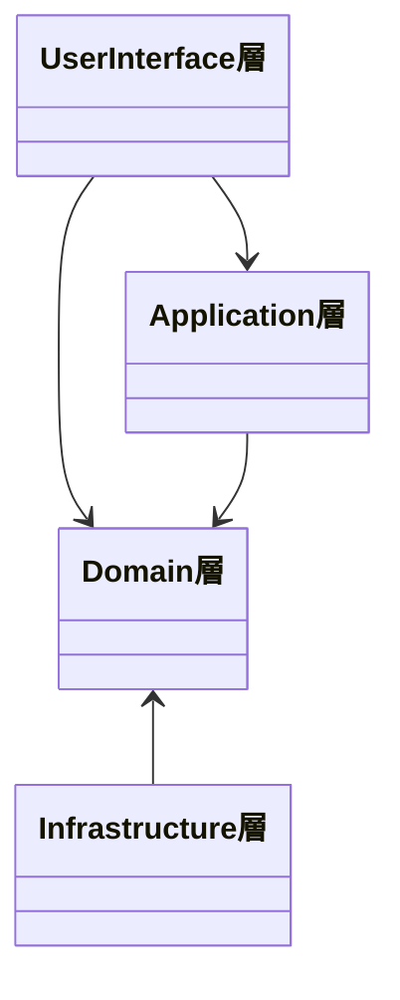

# Layered Architecture

## 目次

1. 本ページにおけるレイヤードアーキテクチャの定義について
2. 各レイヤーの依存関係
3. 各レイヤーで実装される主な内容

## 1.本ページにおけるレイヤードアーキテクチャの定義について

- 「境界づけられたコンテキスト」単位で定義された Go Module は、以下の 4 つの層（レイヤー）を中心に構成する
  - UserInterface 層
  - Application 層
  - Domain 層
  - Infrastructure 層
- それぞれのレイヤーは同名の package にまとめる

### UserInterface 層

- UI 層、Presentation 層とも呼ばれる
- API のクライアント（Web 画面や他システム等）との入出力を司る層
- 主な責務
  - クライアントから送信されたリクエストヘッダ、クエリパラメータ、フォームデータ等を取得
  - 入力パラメータのバリデーションチェック
  - Application 層の アプリケーションサービス のメソッドを呼び出し
  - アプリケーションサービスの返却結果からレスポンスを構築

### Application 層

- UseCase 層とも呼ばれる
- Domain 層のエンティティ単位で アプリケーションサービス を宣言する
- ユースケース単位で アプリケーションサービス のメソッドを作成する
- 各メソッドは基本的にはドメインオブジェクトのメソッド呼び出しとエラーのハンドリングのみ実施する
  - 条件判断や計算等の業務ロジックは アプリケーションサービス には記述せず、ドメインオブジェクト操作の処理順序のみが記述されているのが理想的
  - 業務ロジックは後述する Domain 層に閉じ込める
- DB トランザクションもアプリケーションサービスのメソッド単位で Commit/Rollback する形を基本とする

### Domain 装

- ドメインオブジェクトで構成される層（エンティティ、値オブジェクト、リポジトリ等）
- 条件判断や計算等の業務ロジックはこの層のオブジェクトに極力入れるのが望ましい

### Infrastructure 層

- DB やファイル操作、外部 API 呼び出し等の外部システムへ接続して実施する操作を司る層

## 2.各レイヤーの依存関係

以下の図の矢印の方向への依存のみを許可



## 3.各レイヤーで実装される主な内容

- [認証 API のサンプルコード](./auth-api-sample-code.md)を例に、各レイヤーで必要な実装を整理

### UserInterface 層実装例

- `userinterface`パッケージで実装する
- 本体となる構造体を定義する
  - サンプルコードの例だと`AuthController`
  - フィールドとして持つアプリケーションサービスは、Application 層に定義された interface を指定する(実体ではない)
- `type gin.HandlerFunc func(*gin.Context)`を満たすポインタレシーバメソッドを構造体に対して定義する
  - Web フレームワークの Gin のルーティング用の関数として使うので、`gin.HandlerFunc`を満たすメソッドにしておく必要がある
  - サンプルコードの例だと`PasswordAuthHandler`

```go
type AuthController struct {
    service application.AuthService
}

type AuthRequest struct {
    ID       string `json:"id"`
    Password string `json:"password"`
}

func (c *AuthController) PasswordAuthHandler(ctx *gin.Context) {
    var req AuthRequest
    if err := ctx.ShouldBindJSON(&req); err != nil {
        ctx.Status(http.StatusUnauthorized)
        return
    }

    if err := c.service.Auth(ctx, domain.UserID(req.ID), domain.Password(req.Password)); err != nil {
        ctx.Status(http.StatusUnauthorized)
        return
    }
    ctx.Status(http.StatusOK)
}
```

### Application 層実装例

- `application`パッケージで実装する
- アプリケーションサービスの interface を`services.go`で定義する
  - サンプルコードの例だと`AuthService`
- 1 つ 1 つのアプリケーションサービスの interface を実装した struct をそれぞれ別ファイルで定義する
  - サンプルコードの例だと`authService`
  - フィールドに持つリポジトリは、Domain 層で定義された interface を指定する
    - `repo domain.AuthRepository`が該当
  - フィールドに持つトランザクション管理オブジェクトは、Application 層で指定された interface を指定する
    - `tx Transaction`が該当
- アプリケーションサービスのメソッド内でトランザクションを開始
  - 正常終了で Commit, エラー発生で Rollback するように実装する

```go
// src/authentication/application/auth_service.goから抜粋
type authService struct {
    repo domain.AuthRepository
    tx   Transaction
}

var _ AuthService = new(authService)

func (s *authService) Auth(ctx context.Context, uID domain.UserID, password domain.Password) error {
    err := s.tx.Transaction(ctx, func(ctx context.Context) error {
        return s.repo.PasswordAuth(ctx, uID, password)
    })

    return err
}
```

```go
// src/authentication/application/transaction.goから抜粋
type Transaction interface {
    Transaction(ctx context.Context, fn func(ctx context.Context) error) error
}
```

### Domain 層実装例

- `domain`パッケージで実装する
- 各ドメインオブジェクトの基本的な実装方針
  - エンティティは原則`struct`として宣言し、`<<struct_name>>.go`という形式のファイル名で独立して管理
  - 値オブジェクトは原則、基本型を拡張する形で定義する(`type UserID string`等)。大きなオブジェクト以外は`values.go`ファイルでまとめて管理
  - リポジトリは interface として宣言する。原則として`repositories.go`ファイルでまとめて管理
    - 実体の実装は`infrastructure`パッケージで行う

### Infrastructure 層実装例

- `infrastructure`パッケージで実装する
- サンプルの例だと OR マッパーとして Gorm を使用
- Domain 層のリポジトリ実装は`<<repository_name>>.go`という形式のファイル名で管理
  - `struct`として宣言する
  - `conn`メソッドで`context.Context`から Gorm のトランザクションオブジェクトを、トランザクションがなければ通常のDBセッションを払い出すように作り、トランザクション内外を問わず使用できるようにしている
    - 複数の`infrastructure`層のメソッドでトランザクションを引き回すための対応
- Application 層のトランザクション管理オブジェクトの interface の実装は`DB`という struct を宣言して`database.go`ファイルで宣言する
  - `Transaction`メソッドでは引数として受け取った関数が正常終了の場合は Commit, `error`を返却する場合は Rollback するよう実装している

```go
// src/infrastructure/auth_repository.goから抜粋
type AuthRepository struct {
    db *DB
}

var _ domain.AuthRepository = new(AuthRepository)

func (r *AuthRepository) conn(ctx context.Context) *gorm.DB {
    tx, ok := ctx.Value(txKey).(*gorm.DB)
    if ok && tx != nil {
        return tx
    }

    return r.db.Session(&gorm.Session{})
}

func (r *AuthRepository) PasswordAuth(ctx context.Context, uID domain.UserID, password domain.Password) error {
    // パスワード認証の処理は割愛
    return nil
}
```

```go
// src/infrastructure/database.goより抜粋
type TxKey string

const txKey TxKey = "auth_tx"

type DB struct {
    *gorm.DB
}

var d *DB

func (d *DB) Transaction(ctx context.Context, fn func(ctx context.Context) error) (err error) {
    tx := d.Begin()
    defer func(tx *gorm.DB) {
        if r := recover(); r != nil {
            tx.Rollback()
            err = errors.New(fmt.Sprintf("recovered from panic, err: %s", r))
        }
    }(tx)

    txCtx := context.WithValue(ctx, txKey, tx)
    if err = fn(txCtx); err != nil {
        tx.Rollback()
        return err
    }

    tx.Commit()

    return nil
}
```
